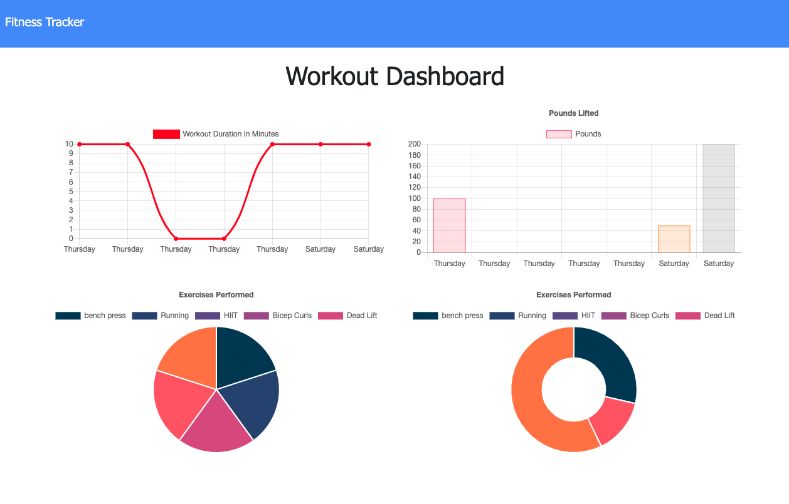
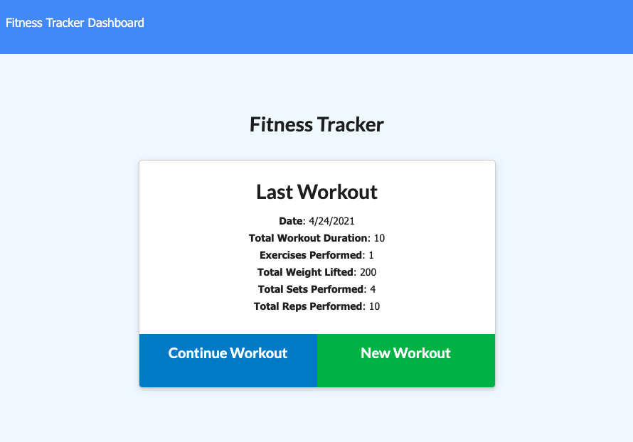
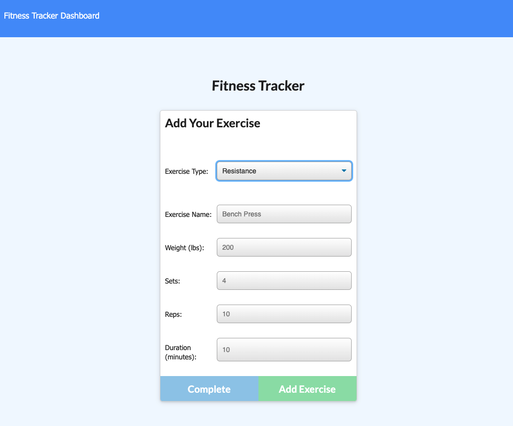

# Fitness Tracker

### Languages And Tools Used:

 
 
 
 

 
 
 
 

 

---
  ## Description
  Fitness Tracker allows you to view, create, and track daily workouts. In this app, you can log multiple cardio or resistance exercises per day, as well as track them by different categories. This app was created, in part, to illustrate my work with MongoDB, Mongoose, Express, Node.js, and JavaScript. 
## Table of Contents 
  * [Installation](#installation)
  * [Usage](#usage)
  * [Questions](#questions)
  ## Installation 
  Access website at: https://serene-dusk-47892.herokuapp.com/
  ## Usage 
  User can log resitance exercises and track them by name, type, weight, sets, reps, and duration of exercise. Or a user can log cardio exerises and track them by name and distance traveled. 
  ## Questions? 
  https://github.com/spclk

